# ERP IMS - Inventory Management System SaaS

A lightweight inventory and purchasing management system built with **FastAPI + SQLite3**. It supports multi-user accounts (admin / staff) and is suitable for self-hosted deployment in small to medium-sized businesses.

[](LICENSE)
[](https://www.python.org/)
[](https://fastapi.tiangolo.com/)
[](https://github.com/stanwu/saas-erp-ims/actions/workflows/unit-tests.yml)

---

## Features

| Module | Features |
|------|------|
| Product Management | Product CRUD, SKU, unit, reorder point alerts |
| Inventory Management | Multi-warehouse stock levels, atomic movement records |
| Purchase Orders | Create purchase orders -> submit -> partially/fully receive, with automatic stock updates |
| Suppliers | Supplier data management |
| Movement Records | Complete audit logs (inbound / outbound / stock adjustment / warehouse transfer) |
| Dashboard | Low-stock alerts, open purchase orders, recent movements |
| User Management | Multi-user accounts with admin / staff roles |

---

## Screenshots

### Login


### Dashboard

Overview of low-stock alerts, open purchase orders, and recent inventory movements.

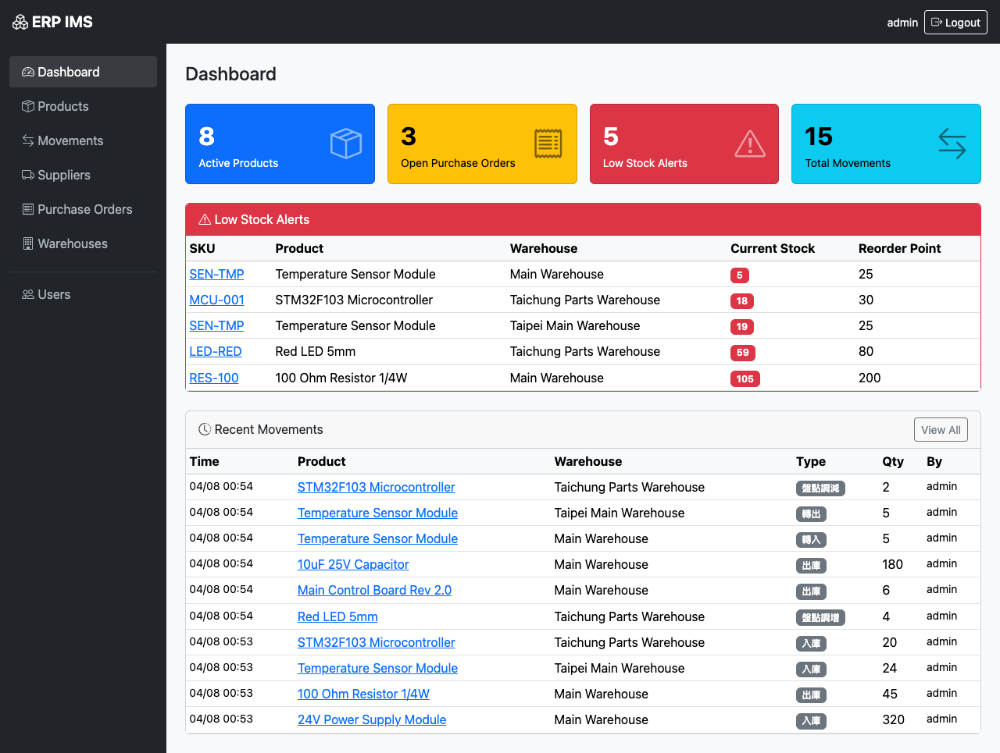

### Product Management

Supports search and pagination, with visibility into stock levels across warehouses.

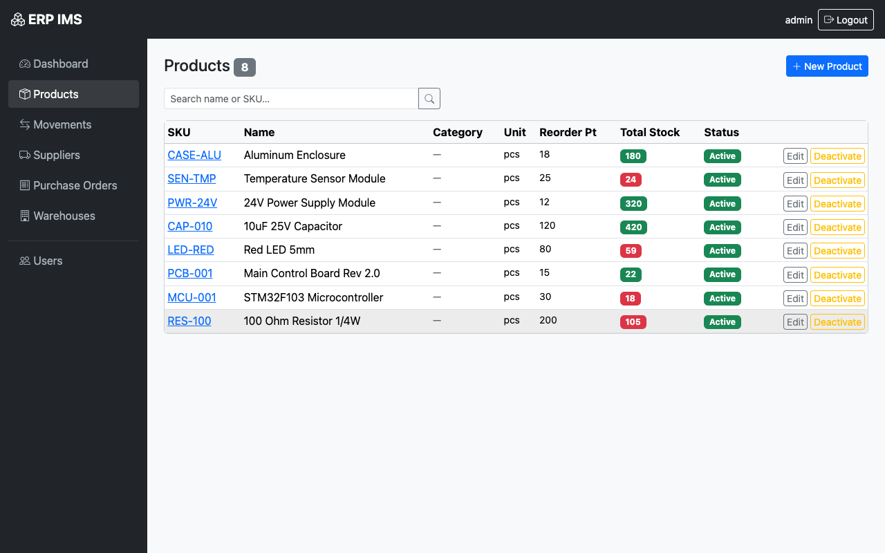

### Create Product

Configure the SKU, unit, cost, and reorder point.

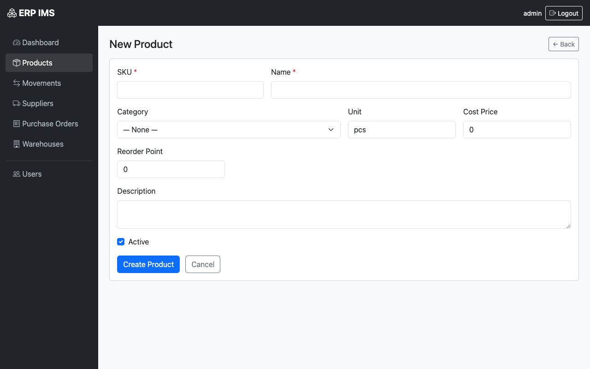

### Product Detail

Displays product metadata, per-warehouse stock levels, and recent inventory activity for a single SKU.

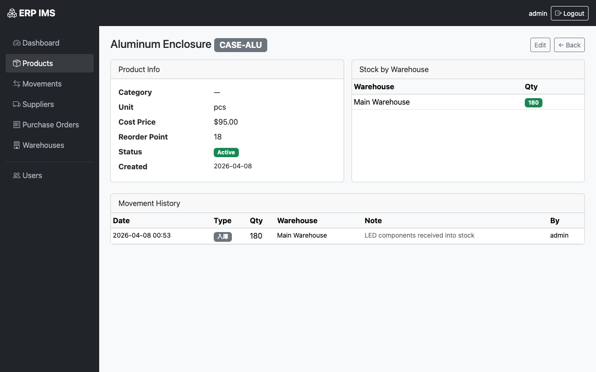

### Inventory Movement Records

Complete audit logs with pagination and filtering support.

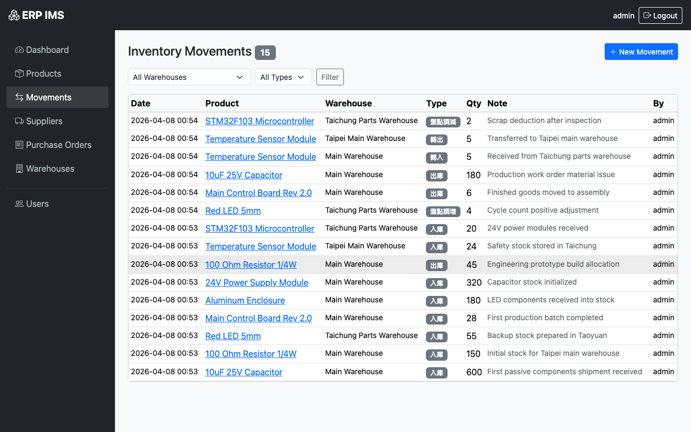

### Create Inventory Movement

Supports inbound, outbound, stock count increases/decreases, and warehouse transfers.

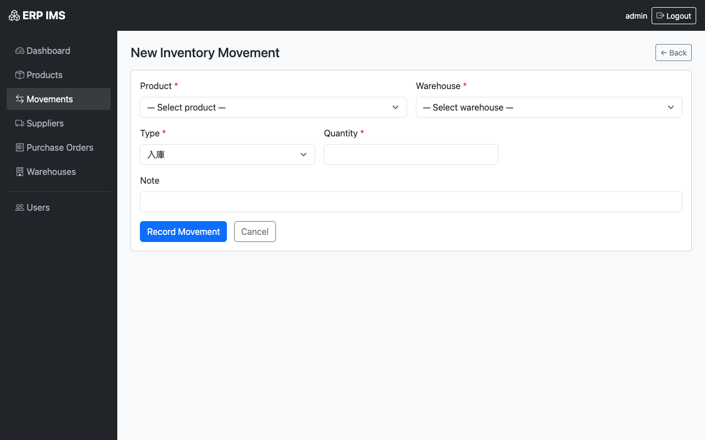

### Supplier Management

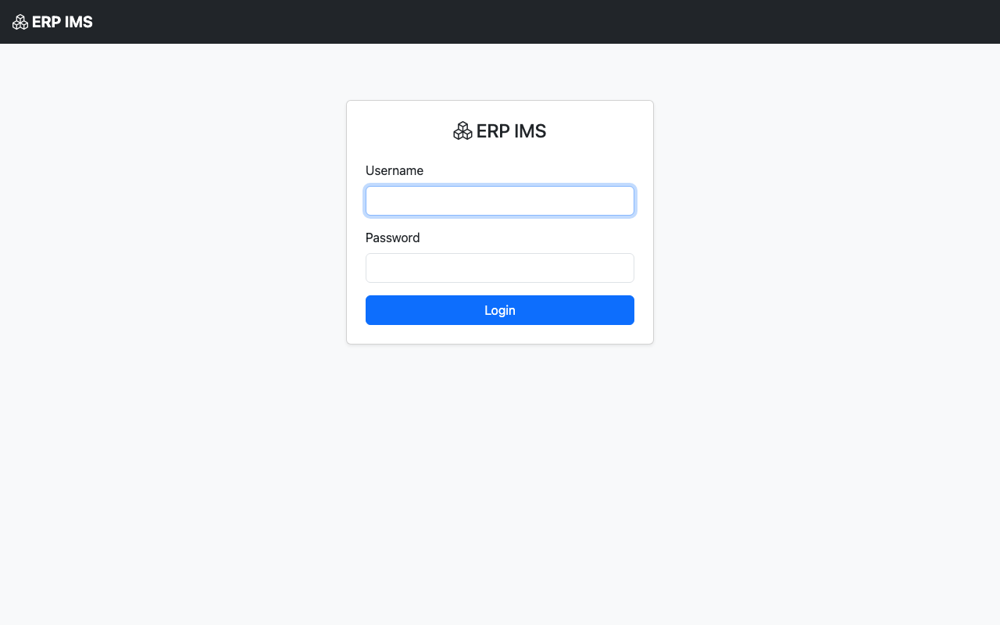

### Create Supplier

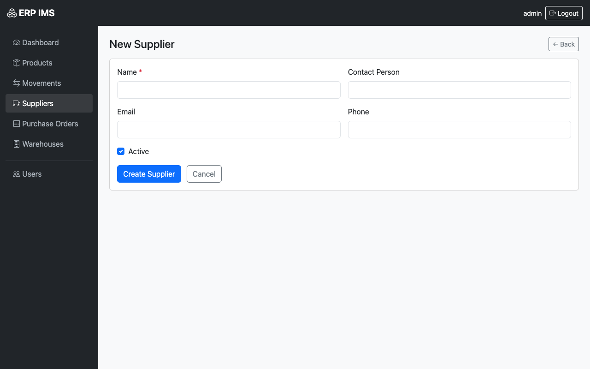

### Warehouse Management

Supports multiple warehouses, with each product tracked independently in each warehouse.

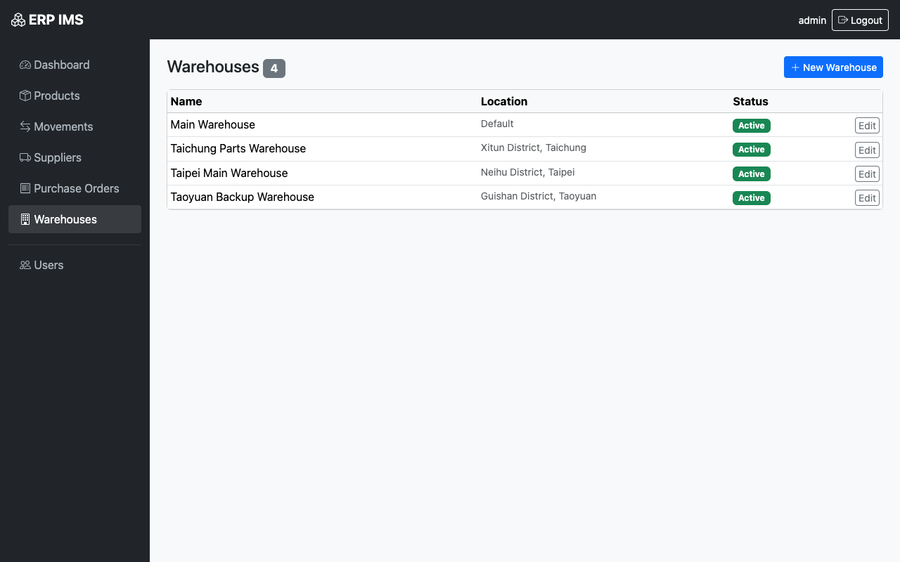

### Purchase Orders

Status flow: Draft -> Submitted -> Partially Received -> Fully Received.


### Create Purchase Order

Select the supplier and warehouse, then add products line by line.

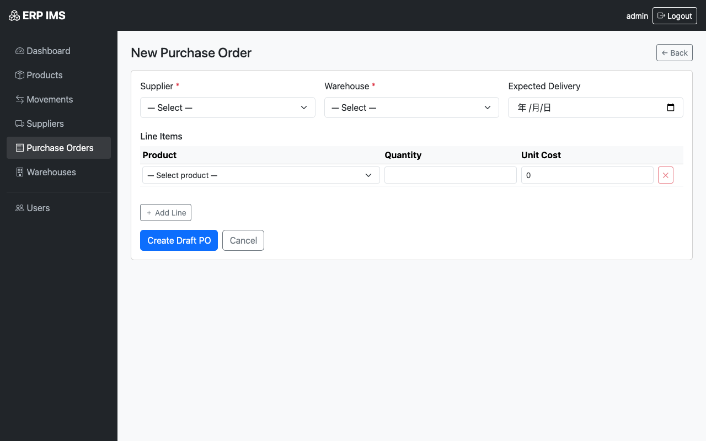

### User Management

Admins can create, edit, deactivate users, and assign roles.

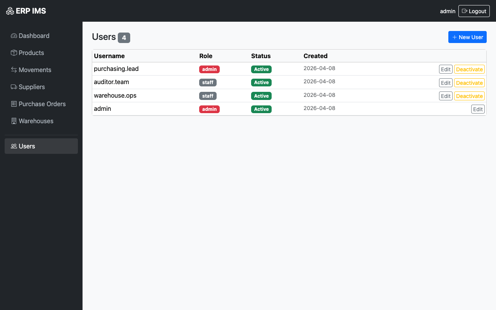

---

## Quick Start

### Requirements

- Python 3.12+

### Installation

```bash
git clone https://github.com/stanwu/saas-erp-ims.git
cd saas-erp-ims

# Create a virtual environment
python3 -m venv .venv
source .venv/bin/activate      # Windows: .venv\Scripts\activate

# Install dependencies
pip install -r requirements.txt

# Start the server
uvicorn app.main:app --reload
```

Open your browser and go to **http://localhost:8000/login**

### Docker Compose

```bash
docker compose up --build
```

The application will be available at **http://localhost:8000/login**.

SQLite data is stored in the Docker volume `erp_ims_data`.

### Default Account

| Username | Password | Role |
|------|------|------|
| `admin` | `admin12345` | Admin |

> **Important:** Change the default password immediately in "User Management" after your first login.

### Environment Variables

| Variable | Default | Description |
|------|--------|------|
| `ERP_IMS_SECRET_KEY` | `dev-secret-key` | Session encryption key (must be changed in production) |
| `ERP_IMS_DATABASE_URL` | `sqlite:///erp_ims.db` | Database connection string |
| `ERP_IMS_ADMIN_USERNAME` | `admin` | Initial admin username |
| `ERP_IMS_ADMIN_EMAIL` | `admin@example.com` | Initial admin email |
| `ERP_IMS_ADMIN_PASSWORD` | `admin12345` | Initial admin password |

---

## Workflow

### Initial Setup

1. **Create a warehouse**: Go to "Warehouse Management" -> "Add Warehouse"
2. **Create products**: Go to "Product Management" -> "Add Product", then enter the SKU, name, unit, cost, and reorder point
3. **Create suppliers**: Go to "Suppliers" -> "Add Supplier"

### Purchasing and Receiving

1. Go to "Purchase Orders" -> "Add Purchase Order"
2. Select the supplier and target warehouse, then add line items with quantity and unit price
3. After saving, the order status is "Draft". Confirm it, then click "Submit Purchase Order"
4. After receiving the goods, click "Receive" and enter the actual received quantity
5. The system automatically creates inbound inventory movements and updates stock levels in the selected warehouse

### Manual Inventory Movements

Go to "Add Movement" and choose one of the following:

| Type | Description |
|------|------|
| Inbound | Goods are added into a warehouse |
| Outbound | Goods leave a warehouse (sales / material issue) |
| Stock Count Increase | Physical count is higher than the system quantity |
| Stock Count Decrease | Physical count is lower than the system quantity |
| Warehouse Transfer In | Goods received from another warehouse |
| Warehouse Transfer Out | Goods sent to another warehouse |

### Low-Stock Alerts

When the stock of a product in any warehouse falls below its reorder point, the dashboard displays an alert.

---

## Data Model

```
users               — User accounts (admin / staff)
products            — Products (SKU, name, cost, reorder point)
warehouses          — Warehouses
stock_levels        — Real-time stock per product per warehouse (product × warehouse)
inventory_movements — Immutable audit log of inventory movements
suppliers           — Suppliers
purchase_orders     — Purchase orders (draft -> submitted -> partial -> received)
purchase_order_lines — Purchase order line items
```

**Core design principle:** Inserts into `stock_levels.quantity` and `inventory_movements` are executed within the same database transaction to ensure data consistency.

---

## Development

```bash
# Run tests
pytest tests/ -v
```

```bash
# Install pre-commit into the project virtual environment
pip install -r requirements.txt
.venv/bin/pre-commit install

# Run the sensitive data scan manually
.venv/bin/pre-commit run --all-files
```

---

## License

[MIT](LICENSE) © 2026 stan
